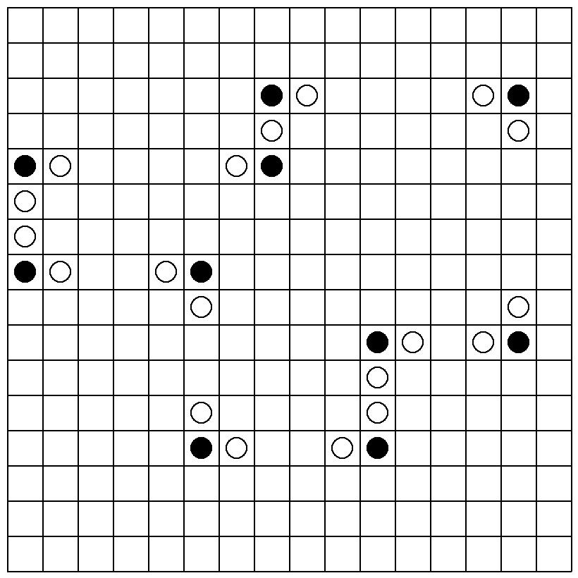

# Secondo progetto del corso di algoritmi e strutture dati (docente Alberto Montresor)

## Topic: problemi NP completi e problemi di approssimazione

Il problema consisteva nel trovare il percorso che attraversasse più anelli possibili (rispettando le regole di attraversamento) in un tempo massimo fissato. 

La soluzione proposta fa uso di diverse tecniche di programmazione: greedy, scelta casuale, backtrack con pruning e ricerca locale. 

Nella repository è possibile trovare: 
* il [**dataset**](./dataset_swrace) usato per la correzione e valutazione del progetto
* il [**testo del progetto**](./doc/prog2.testo.pdf) con tutte le specifiche
* la nostra [**soluzione**](./lib/swrace.cpp) al problema proposto
* una [**spiegazione**](./doc/prog2soluz.pdf) della soluzione proposta. 

Per compilare ed eseguire il codice consultare il file [prog2.testo.pdf](./doc/prog2.testo.pdf). 

### Test del progetto

Per creare le immagini dei vari output generati dall'algoritmo è possibile usare uno script in *Ruby* presente nella cartella test.

Se si desidera utilizzarla è necessario avere installato [ImageMagick](https://imagemagick.org/script/download.php), una versione di [Ruby](https://www.ruby-lang.org/en/downloads/), il packet manager [RubyGems](https://rubygems.org/) e la gemma [Bundler](https://bundler.io/).

Successivamente effettuare i seguenti passi:

Clonare il progetto:

```shell
$ git clone https://github.com/emanuelebeozzo/progetto2algoritmi.git
```

Installare le dipendenze:

```shell
$ bundle install
```

Recarsi nella carella test:

```shell
$ cd test
```

Ed eseguire il seguente comando:

```ruby
ruby generate_paths.rb ../path_to_input.txt ../path_to_output.txt
```

Dove gli argomenti dello script sono il file di input del problema e il relativo file di output.

In automatico genererà una cartella *img* con all'interno tutti i percorsi generati.

### Performance e Considerazioni

Il programma si è rivelato in grado di saper svolgere egregiamente grafi sparsi oppure densi ma di dimensione ridotta. L'idea di utilizzare la ricerca locale per poter migliorare le soluzioni ogni volta, di impedire all'algoritmo di cercare una soluzione migliore prima di aver trovato una di almeno ugual valore e l'implementazione di una sottospecie di backtrack in modo da poter tornare all'anello precedente hanno permesso nel complesso di ottenere un punteggio di 72.5/100.

Proponiamo di seguito un paio di gif che mostrano il funzionamento dell'algoritmo e basate sulle soluzioni ottenute da input del dataset




